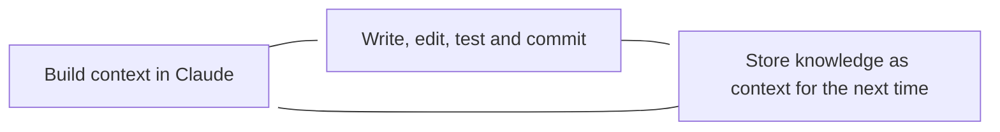

## Introduction

As Suhail points out, the IDE is a well-established tool for software development. It is where we write code, run tests, and debug. It is the place where we spend most of our time as developers. So, it makes sense that AI would extend that already well-defined developer experience.

<blockquote class="twitter-tweet">
I don&#39;t really get Claude Code. Why do you guys want to sit in a terminal to look over changes vs the multi-tasking capability and UX of the whole IDE? I must be missing something!
&mdash; Suhail (@Suhail) <a href="https://twitter.com/Suhail/status/1937969471546880495?ref_src=twsrc%5Etfw">June 25, 2025</a></blockquote> 

And we already have more than a few AI agents that are based in the IDE. Many are well known at this point:

- [GitHub Copilot](https://github.com/features/copilot)
- [Cursor](https://cursor.com/en)
- [Windsurf](https://windsurf.com/)

And no doubt many others that I'm skipping over. But the thing is this. Despite being locked into the terminal, Claude Code is by far the most powerful coding agent. While formal benchmarks for agents do [exist](https://www.confident-ai.com/blog/llm-agent-evaluation-complete-guide), they remain far less common and don't necessarily cover particular products. You can get a sense of the models from [SWE Bench](https://www.swebench.com/), where Claude models are consistently at the top. Or you can look at informal assessments like Timothy B. Lee's:

What I learned trying seven coding agents by Timothy B. Lee

There's still room for improvement, but don't underestimate this technology.
<a data-post-link href="https://www.understandingai.org/p/what-i-learned-trying-seven-coding">Read on Substack</a>

Or you can look at the blossoming number of imitators trying to push the same (possibly inferior!) UX:

-  [Gemini CLI](https://blog.google/technology/developers/introducing-gemini-cli-open-source-ai-agent/)
-  [OpenAI Codex](https://openai.com/index/introducing-codex/)

While competitors work to replicate Claude's terminal-based power, Anthropic is doing the reverse: bringing its best-in-class agent directly into the developer's native environment. As recent as a few of [weeks ago](https://marketplace.visualstudio.com/items?itemName=anthropic.claude-code), Anthropic started adding ways to make Claude Code available in your IDE. With the VS Code extension, you can use your IDE to inspect diffs, quickly add context and share diagnostics with Claude. This makes it the perfect bridge between current SWE workflows and what we might being doing in the near future.

## If you want to try it yourself

You have to give Anthropic their flowers for just how simple they've made it to switch your IDE agent to Claude Code.

-  If you call `claude` in the VS Code terminal, it will automatically set up Claude Code for you. It works with `Cursor` and `Windsurf` as well.
-  You'll get a little Claude Code icon in the top right of you VS Code window. Click it to open the Claude Code sidebar.
-  After that point, you don't have to use the integrated terminal in VS Code. I often start Claude is a separate terminal with `claude --ide` or you can *attach* Claude to your IDE with the `/ide` command.

If you're new to Claude, you should check out [Anthropic's documentation](https://docs.anthropic.com/claude-code/). Pay attention to the

- Docs on [memory](https://docs.anthropic.com/en/docs/claude-code/memory) which is one of the primary ways to configure Claude for your workflow.
- And the docs on custom [slash commands](https://docs.anthropic.com/en/docs/claude-code/slash-commands), which make prompts reusable and generally speed up working with the agent.

There is already a wealth of resources out there on turbocharging Claude Code. Here's a great [curated list](https://github.com/hesreallyhim/awesome-claude-code).

## What a Claude-Code-centric developer workflow looks like

Like I mentioned in my last [post](/2025/06/22/mcps/), Model Context Protocols (MCPS) are the key to getting the most out of your AI development agent. You'll want them for Claude Code as well. You can think of a couple basic families of tools that you'll want for your workflow, but I want to especially focus on context builders, which are the tools that help you build and maintain the context that Claude Code needs to be effective.

Oh, and one quick aside. Claude Code is also an MCP server. This is how you [set that up](https://playbooks.com/mcp/claude-code). [Philipp Spiess](https://spiess.dev/blog/how-i-use-claude-code) has a great intro for what you do when you let Claude manage its own tasks.

### Linear and Notion, my context builder

My primary tool for storing Claude's knowledge right now is [Linear](https://linear.app/), which is a project management tool (think JIRA), but with a much better UX. I use it to track tasks, bugs, and features. But Linear also comes with a nice little doc writing interface for describing projects and issues. And since it has an MCP, you can use Claude to write most of this for you and save it for the next time you'll need it.

While Linear is tightly tied to issues and projects, I also use [Notion](https://www.notion.so/) for more general knowledge management. Notion is a great place to store information that doesn't fit into a project or issue, like company policies, team norms, meeting notes, and so on. And of course, Notion also has an MCP, so you can use Claude to write and update your Notion pages as well.

### Workflow

Here is a very high-level of my Claude Code workflow, it is tied very closely to the idea of being a ["context engineer"](https://x.com/karpathy/status/1937902205765607626).

Before I ever start writing code, I have a few different processes that I might follow to build context for a future project.

-  Planning: We follow something a bit like Google's [OKR cycles](https://www.reforge.com/blog/set-better-goals-with-ncts-not-okrs). A big part of this is taking projects and turning them into issues. This is a good time to brainstorm with Claude and store something akin to a design for when I'll work on this later
-  Diagnosing: Looking at bugs or logs (which should be accessible VIA MCP), I might start a discussion with Claude about the problem and how to solve it. Once we have some good ideas, it can be dumped into Linear for later.
-  Research: If I'm working on a new feature, I might need to do some research. Claude has a search engine built in, so I can have it collect ideas on a good approach. Again, at the end of this discussion, I send the conversation off to Linear.

Once it's time to get to work, I tell Claude that I'm working on a particular issue, and it goes and pulls in all of this previously generated knowledge before we get to work. It's often fully ready to start writing after getting context, which puts us back into a familiar developer cycle of writing, editing, testing, and committing code. Claude Code can use command line tools, which means it now uses our work to generate `git` commits and PRs on GitHub.

Furthermore, I can also use Claude Code to `/review` PRs from GitHub. This can also be a good source of context for future work.

## How much do you actually need the IDE?

Given all of this, what is the IDE for? Well, it's familiar. Claude is often something like a junior developer. It makes mistakes, gets stuck. I might go to a different agent to get a second opinion or make edits myself. For these interventions, having the editor write in front of me is great. If I make changes, I tell Claude to look at the file again, and it can take over.

In many ways, it sounds like it's a bit of a crutch. I can imagine a more powerful future version of Claude that doesn't need some many interventions, but this state of requiring a [human in the loop](https://cloud.google.com/discover/human-in-the-loop?hl=en) seems like it will be necessary for a long time. In a strange way, it solves the "context" problem, in reverse. With an IDE, I can better understand what Claude is doing and why. I can see the code it generates, and I can make changes to it. And this tight collaboration is a big part of the reason why Claude Code is so powerful. 

## Tools for this post

-  [Gemini wrote the original draft of the mermaid JS diagram above](https://g.co/gemini/share/b1ed52aa9520)
-  [Wisk created the header image](https://labs.google/fx/tools/whisk/share/4bcmhal2t0000)
-  [Claude Sonnet](https://claude.ai/share/52df7ddd-4986-4775-b967-85ed5625c839) was my editor.
-  [So was Gemini](https://g.co/gemini/share/e116734972a9)
-  [Claude Code](https://claude.ai) is my best bud for the code writing workflow that I talked about.

