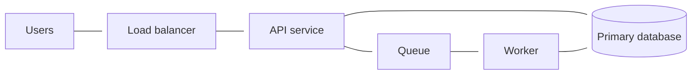

## Introduction
The last few months at Delphos Labs have focused on the V2 of our product, which should be releasing later in the month. We've had some very exciting recent momentum.
- We've started posting about our automated tools for assessing code vulnerabilities, which we were only recently allowed to [disclose](https://delphoslabs.com/blog/36142374-e1fe-80a9-9456-d3c64df81bd5/linux-rxgk-decrypt-mac/)
- And we were able to reproduce days of expert malware research in [minutes](https://delphoslabs.com/blog/36142374-e1fe-819a-973e-f92f97f79587/fast16-binary-analysis/)
As I [previously mentioned](/blog/2026/04/18/marginal-analysis/), we used the opportunity of V2 to fundamentally redesign the architecture and rewrite our stack from scratch in Rust. I have spent most of my work hours deep in infrastructure, with the capstone being a migration of our entire build system to Bazel. Obviously, none of these were small projects, and yet all of them happened at a breakneck pace that seemed impossible only a few years ago.
Take the Rust rewrite. A rewrite of this scale, encompassing an entire product, used to require restaffing a team with language experts before anything could get started. If you wanted to do this, you had a couple of unpleasant choices:
- you could retrain the people you have 
- or you could replace them with people who already know the language
Either way, you would pay for it in months of lost velocity while everyone climbs Rust's famously challenging technical wall. The borrow checker rejects your code until you learn to think the way it wants you to, the compiler is aggressively pedantic and Clippy will throw a fit if you are trying to do anything potentially risky. For most teams it was reason enough not to switch, but we switched in a sprint. Our CTO Caleb Fenton wrote about the [experience](https://calebfenton.substack.com/p/python-is-dead), and his framing has stuck with me: he built twenty thousand lines of Rust for a language he does not know, using agents, and found it easier than writing Python. 
The Bazel move was the same shape. Bazel is the build system Google runs, powerful and notoriously [hard to learn](https://tianpan.co/forum/t/the-build-system-wars-bazel-buck2-pants-and-whether-your-monorepo-actually-needs-one/615), the kind of tool that is supposed to require a team of specialists to keep running. We are not that big; we adopted it anyway. Infrastructure told the same story from a third angle, a wall of specialized languages and unfamiliar habits of thought that came down in weeks rather than years.
I have written [before](/blog/2026/04/18/marginal-analysis/) about where a team should spend its scarce human attention once software itself gets cheap to produce. This is a companion to that idea, pointed at a narrower question, and a stranger one. These tools all made a bargain with their users, and the bargain was always understood to run one way. You accept the tool's rules, you pay in effort and training, and in return the tool makes your work more orderly, more checkable, more legible. The agent changes who pays without changing the bargain. And once you see that, you start to notice that the bargain was never as simple, or as one-directional, as it looked.
## Legibility, and who it serves
The word I keep reaching for is legibility, so humor me while I trace the history of that term. The economist Friedrich Hayek gave the modern version of the underlying idea in 1945, in an essay on what he called the knowledge problem. Most of the knowledge a society runs on, he argued, is not the tidy, general kind you can write in a textbook. It is dispersed across millions of people, tied to particular circumstances of time and place, often held tacitly by the person on the spot who could not fully explain it if you asked. No central planner can gather that knowledge up, because the act of centralizing it destroys the thing that made it valuable.
The anthropologist James C. Scott turned this into a theory of how states fail. In *Seeing Like a State*, one of my absolute favorite books, he describes the state's first problem as visibility: before a government can tax or conscript a population, it has to be able to see it. Standard surnames, uniform measures, and surveyed grids are tools for making that possible. Scott calls the planner's abstract, rule-bound knowledge *techne* and opposes it to *metis*, the practical, local, hard-won intelligence people actually use to live in a place. Legibility is what the state gains when it flattens metis into techne, and his villains are the schemes that flatten too hard: collective farms, planned cities nobody wants to live in, forests planted in rows that then die. The [Slate Star Codex](https://slatestarcodex.com/2017/03/16/book-review-seeing-like-a-state/) review is the best way in if you want more.
It is a seductive frame, and easy to misread. Scott's picture runs downward. A powerful center simplifies people below until it can rule them, so techne reads as the enemy and metis as the victim, and every reader gets to feel like the lumpy human flattened by someone else's spreadsheet. The pseudonymous writer at Alt Binaries has a sharp [essay](https://altdotbinaries.com/2026/05/11/metis-vs-techne/) on that temptation, and the correction is the one I want to borrow: Scott's real contribution "is the angle of vision rather than the argument." The lasting move is not "planners bad, locals good." It is the habit of asking of any arrangement: what is the shape of the simplification, and whose knowledge does not appear in the file?
Because once you hold the angle of vision and drop the villain, you notice that legibility does not only flow downward, and it does not only cost. It gets pushed and pulled by all sorts of things, norms, practices, and now tools, and it moves in more than one direction at once. The internet is the obvious case. 
- It made the world far more legible to an ordinary person; you can now see into markets, communities, and places that were opaque to you a generation ago. 
- It made populations far more legible to institutions too, at a scale Scott's surveyors could not have imagined, which is roughly Shoshana Zuboff's argument in *The Age of Surveillance Capitalism*. 
- And in the same years it made whole domains go dark, as encryption and closed spaces put more and more behavior permanently out of view, which is what the FBI meant when it started warning about "going dark." 
The same tool raised legibility on some axes and lowered it on others, and which side you land on depends entirely on who you are and what you are trying to see. Legibility is not a lever a state pulls. It is a field of forces, and any new tool re-tilts it.
A programming language, an infrastructure schema, a build system's dependency graph: each is a small regime of techne, a set of rules you submit to in exchange for a more orderly and checkable body of work. Adopting one used to mean paying, in your own time and training, to become legible to it. That is the apprenticeship I kept running into and not paying. Today, an agent pays it instead. It absorbs the rules and produces work that satisfies them, which means a person or a small team can now claim a level of legibility, and access a deep well of techne, that used to be reserved for institutions rich enough to train people into it. Agents are a route to more legibility, and that is the good news.
But the frame does not stop there, and the Alt Binaries essay is one we will keep returning to, explicitly and implicitly. Its hardest line is that everyone thinks they are metis and everyone thinks the other guy is techne. The article recommends a new discipline worth keeping: ask, whenever you feel flattened, who you are flattening. Choosing more techne is still a flattening. It buys order by throwing something out, and it moves legibility around rather than simply adding it. So the same tools that make our work more legible in one direction quietly make it less legible in another, and the thing that ends up in shadow is not the code. It is us.
## Rust: correctness you can see before you run it
Start with the language, because it is the cleanest case. The whole point of Rust is that it is strict. Its type system and its borrow checker are a set of rules about ownership and lifetimes that your code has to satisfy before it will compile at all, and satisfying them rules out entire families of bug in advance. 
The reason strictness felt like a cost is that a human was paying it. Caleb put this better than I can. Writing Python with an agent, he says, "you're basically the compiler that Python doesn't have, except you're a human, so you miss things." You babysit the types the language will not check, you catch the bugs it will not catch, and you do it imperfectly because you are tired and there is a lot of code. Writing Rust with an agent, the arrangement inverts: "the actual compiler did the babysitting." The borrow checker is just a well-specified set of rules, and following rules exactly, over and over, without getting frustrated, is the one thing an agent is unambiguously good at. The wall does not exist for something that does not mind being told no forty times in a row.
What you get on the other side of the wall is correctness that is legible in advance, and the scale of it is easy to underrate. Microsoft [reported](https://msrc.microsoft.com/blog/2019/07/we-need-a-safer-systems-programming-language/) years ago that around 70% of the vulnerabilities it assigned a CVE were memory-safety issues, a proportion that barely moved across more than a decade of C and C++. Google took the other [path](https://security.googleblog.com/2024/09/eliminating-memory-safety-vulnerabilities-Android.html) with Android and watched the number fall: memory-safety bugs were 76% of Android's vulnerabilities in 2019, and 24% by 2024, as new code got written in memory-safe languages rather than the old ones. A strict language does not make a program correct. But it takes a large, expensive, historically dominant class of error and makes it a thing the compiler can see and refuse, before the code ever runs, before a customer ever finds it. That is legibility in the most practical sense available to a working engineer.
This is the first instance of a shape that will repeat: a strict, machine-checkable target, the compiler plus Clippy and the test suite, and an agent that will grind against it without complaint until it passes. And the strictness is not something the agent merely tolerates. It actively helps. 
The freedom we used to grant ourselves, because rules were tedious and we were the ones who had to follow them, turns out to be the dangerous setting for an agent. To borrow an old expression, you get just enough rope to hang yourself. Give a model a loose objective and a lot of room and it will find the cheap way through, which is not usually the way you meant. Constrain it against a real check and it does better work. One [study](https://developer.nvidia.com/blog/improving-bash-generation-in-small-language-models-with-grammar-constrained-decoding/) of small models generating shell commands found that constraining generation to a grammar lifted the mean success rate from 62.5% to 75.2%; the same paper is careful to add that a syntactically valid command "can still be semantically wrong or operationally unsafe," which is precisely the seam this piece will pull on later. Strictness raises the floor. It does not raise the ceiling all the way to correct.
The checks get pleasantly petty, too, and pettiness is a gift to an agent. Rust will tell you about dependencies you pulled in and never used: turn on the `unused_crate_dependencies` lint and the compiler flags the crate you added, experimented with, and forgot to remove. There is even a small tool, [cargo-machete](https://github.com/bnjbvr/cargo-machete), built just to hunt down unused dependencies. These are trivial mistakes and tedious to police by hand, which is exactly why a tireless worker paired with a tool that catches them is such a good match. 
Let's take that even further, into a bit of speculation. If strictness is a feature once an agent is the one paying for it, then the languages we have are not the end of the line. They are the strictest tools a human could still stand to use. A language built for an agent could go much further, and demand things in the code that a person would find tedious to write and hard to read. Consider a verified language like [Dafny](https://dafny.org/), where you state up front what a function must guarantee and the compiler proves it before the program ever runs:
```dafny
method NonNegativeIncrement(x: int) returns (y: int)
  requires x >= 0
  ensures  y >= 0
{
  y := x + 1;
}
```
The `requires` and `ensures` lines are not comments or tests. They are a contract the verifier checks statically; change the body to `y := x - 1` and the program does not compile, because the tool can prove a caller passing `0` would break the guarantee. That is correctness made legible in the strongest sense, checked in advance rather than hoped for at runtime. It is also more to write and more to read than the one-line version a human would dash off, which is exactly why languages like this stayed in a research and high-assurance niche. The ergonomic cost fell on a person.
None of this is hypothetical. The strict end of the spectrum already exists; it was just never worth the friction for most work. Verified languages like Dafny, or effect-typed ones like [Koka](https://koka-lang.github.io/koka/doc/index.html) where every function must declare what it touches, have sat in a research and high-assurance niche for years precisely because the strictness was too tedious for a human to bother with. Stranger still are the languages now being built from the start for an agent to write, where human readability is not even a goal. [Zero](https://github.com/vercel-labs/zero), an experiment from Vercel Labs, has its compiler emit machine-readable repair plans so the agent can read its own errors and fix them in a loop, no human in the middle.
I do not know which of these, if any, becomes the way agents write code; most are experiments, and not anything you would ship today. The point is not the specific bet. It is that the whole class of "too strict to be pleasant" was defined by human patience, and human patience is no longer the binding constraint. For fifty years we climbed the abstraction ladder toward languages easier for people to read, trading away machine precision at every rung. The reader is no longer human. Some of that climb is starting to run in reverse.
## Infrastructure: a subdomain the agent can speak
Modern infrastructure lives in code now, in tools like Terraform and the pile of YAML that describes a Kubernetes cluster. This sounds like ordinary programming, but it definitely is not. It is a separate discipline with its own dialect and its own habits of mind. You do not write out the steps to build something; you declare the state you want the world to end up in, and a reconciler figures out the difference between that and reality and tries to close it. The tools have their own language, their own idea of state, their own catalog of ways to hurt yourself. Aembit put the difficulty [well](https://aembit.io/blog/infrastructure-as-code-is-more-complicated-than-you-think/): infrastructure code carries "a very high density of required knowledge (per line of code)," and because of how much one line can move, "the margin for error is tiny." There is a whole shelf of books, [Brikman's](https://www.terraformupandrunning.com/) is the standard one, teaching the patterns you need to work in it safely: modules, remote state, keeping environments apart. It is real techne, learnable, and expensive to learn, which is why so many small teams simply never became fluent and made do with whatever they could copy from a tutorial.
This is the same bargain as the language, and it resolves the same way. The unfamiliar model and the dialect were the wall. An agent has read more Terraform than any of us ever will, and it does not experience the shift from writing steps to declaring state as a shift at all; it just writes in the dialect. You describe the infrastructure you want in plain terms, and the agent produces configuration that fits the schema. And once again there is a strict, layered set of checks it can be held to before anything real happens: `terraform validate` for well-formedness, a linter and a policy scanner like Checkov for the known-bad patterns, and `terraform plan` to show exactly what would change. That is the second instance of the pattern. A strict, machine-checkable target, plus an agent that will iterate against it, equals a capability that used to require a specialist you could not afford.
The infrastructure case also makes the danger vivid, in a way the language case did not. A compiler error stops the build and nothing happens. A bad infrastructure change deletes a database. In [July 2025](https://fortune.com/2025/07/23/ai-coding-tool-replit-wiped-database-called-it-a-catastrophic-failure/) an AI agent on Replit did exactly that, wiping a live production database during a supposed code freeze; the company's CEO called it "unacceptable and should never be possible." As before, something was granted just a little too much rope. The agent's freedom is its blast radius, and the guardrail is the same one you would use on a new hire you did not fully trust yet: give it the narrowest access that lets it do the job, and make the destructive actions the ones a human still has to approve. The whole security industry has a name for this, least privilege, and it matters more, not less, when the thing holding the credentials is a fast, tireless, non-deterministic worker that will do precisely what you said and not at all what you meant.
There is a second thing agents do with infrastructure, and it runs in the other direction. Configuration is legible to the machine that executes it and nearly opaque to the human trying to understand the system it describes. You can read every line of a Terraform module and still not hold the shape of the thing in your head. Recovering that shape, a picture of what talks to what, used to be its own separate skill; you learned a diagramming tool or a diagram language like Mermaid or C4, and you drew it by hand, and the drawing was stale the moment someone changed the infrastructure. Simon Brown, who created the C4 model, has made this point for years: diagrams kept by hand drift away from the system they claim to describe. An agent removes that whole chore. It reads the configuration and hands you the picture, generated from the current state, as easily as it wrote the configuration in the first place:

This is the clearest example in the whole piece of an agent surfacing knowledge that was already there but locked up. The architecture was always implied by the configuration. Reading it out was the tacit, effortful part. Here is the metis, and it belonged to whoever wrote the files. The agent does it on demand, for anyone. In principle this runs both ways, and you could draw the diagram you want and have the agent produce the configuration to match; in practice almost nobody works that way yet, and the direction that earns its keep today is code to picture, for a human to read, and text to agent, for it to implement.
Of course, caveats abound and agents are far from perfectly reliable. The generated picture can be confidently wrong. One survey of AI diagramming tools found they "frequently misplace security boundaries, VPC groupings, and network segmentation because these are implicit in infrastructure configuration, not explicit." This sounds a bit like a technical problem, and it is one we have been seeing steady improvement on as agent capability grows. Still, the diagram is a comprehension aid and a check, a way to see whether the agent built roughly what you meant. It is not the truth of the system, and trusting it as if it were is its own quiet way of going blind.
## Bazel: renting the discipline of a much larger company
The capstone of the last few months was moving our build over to [Bazel](https://bazel.build/), the build system that Google uses, and one of the pieces of Google infra that I was able to reclaim at Delphos. Its defining idea is hermeticity: every build step declares its inputs and its outputs exactly, nothing sneaks in from the surrounding machine, and so the same inputs always produce the same result. That property is what lets a build be both fast and correct at once, which the [engineers who wrote it up](https://abseil.io/resources/swe-book/html/ch18.html) describe as the whole point; caching and parallelism are safe precisely because the graph of dependencies is complete and explicit. A build you can trust to be reproducible is a build you can reason about. It is legibility, applied to the act of turning source into software.
And, predictably by now, it is strict, and the strictness has a reputation. You describe your build in a language called Starlark, and you have to say everything, every dependency, every input, out loud. One engineer's [account](https://tianpan.co/forum/t/the-build-system-wars-bazel-buck2-pants-and-whether-your-monorepo-actually-needs-one/615) of adopting it is blunt: "the learning curve is brutal. BUILD files feel like learning a new language (because you are — Starlark)." Starlark is the least of it, though; it is essentially Python with a few quirks, and nobody who can already code struggles with the syntax. The misery is elsewhere. It is taking a build that worked under Make or CMake through years of accreted compiler behavior and rediscovering the exact set of flags, linker values, strange substitutions and other flavors of magic words that make it compile again, now stated explicitly in a form Bazel will accept. 
A single target can end up looking like this:
```python
cc_library(
    name = "core",
    srcs = ["core.cc"],
    copts = select({
        ":linux_gcc": ["-std=gnu++17", "-fno-exceptions", "-fno-rtti", "-Wno-unused-parameter"],
        "//conditions:default": ["-std=c++17"],
    }),
    defines = ["NDEBUG", "USE_CUSTOM_ALLOCATOR", "POSIX"],
    linkopts = ["-pthread", "-ldl", "-Wl,--no-as-needed"],
    deps = ["//third_party/expat", "//third_party/openssl:crypto"],
)
```
Almost none of the difficulty there is Bazel or Starlark. It is knowing that this particular library needs exceptions and run-time type information turned off, that it will not link without `--no-as-needed`, that the flags differ when the compiler does. Every one of those lines is a fact about a toolchain that someone, once, worked out by trial and error, and that you are now transcribing into a stricter form that will not tolerate leaving any of it implicit. Bazel is easy when it is easy. When it is not, you are reverse-engineering a decade of toolchain assumptions one cryptic error at a time. The engineer whose account I quoted writes that his team "spent 3 months in a significantly degraded state" during the migration, with "feature velocity dropped 25% during the migration quarter." That is the tax, and it is a real one. It is also exactly why the conventional wisdom is that Bazel only makes sense above a certain size.
The way Google affords that tax is the part worth drawing out. Google doesn't hide the build system from its engineers. Instead, from the day you arrive, Google *teaches* you the build system, backed by some of the best internal documentation I have ever used, and it drops you onto a team where everyone already knows it cold. When you get stuck, the answer is a desk away or a doc away. That is the best of both worlds Scott would recognize: the codified techne of a mature, documented system, and the living metis of colleagues who have internalized it, both handed to a newcomer at once. The strictness is still there, but the enormous cost of climbing into it has been socialized across a company that decided, long ago, to pay it. A four-person startup has neither the documentation nor the room full of experts. Historically that settled the question. You did not adopt the Google build system, because you could not reproduce the Google onboarding.
That is the constraint the agent lifts, and it does not lift it by being smart. At this point, it's obvious that the agent has read and absorbed Starlark, but so what; the syntax was never the hard part. The hard part was the toolchain archaeology, and here the agent's great advantage is temperamental rather than intellectual. It is perfectly content to try a set of linker flags, watch the build fail, read the error, adjust, and try again, fifty times, at three in the morning, without the mounting frustration that makes a human start cutting corners. Even better, there is no ego. If one agent hits a wall, clear the context and hand it off to another. Maybe Fable will figure it out; or maybe Sol will. You, the human, can still be confident that there is a path through this.
What keeps that loop honest is that Bazel will not lie to it. Because the dependency graph is hermetic, the build either succeeds for real reasons or fails with a specific, locatable complaint; nothing compiles by accident through some ambient state on the machine. `bazel build` and `bazel test` are a correctness signal about as crisp as they come, and the agent's whole job is to grind against it until it goes green.
The dependency errors are the clearest case, and exactly the kind of thing a human hates. Bazel insists that every target declare precisely the dependencies it uses, no more and no less; use something you did not declare and it fails, even if the code compiles today because another dependency happened to pull that library in. Getting this right by hand means holding the whole transitive graph in your head and keeping it current through every refactor, which is miserable and which nobody does perfectly. This is the same housekeeping Rust needs a lint or a tool like [machete](https://github.com/bnjbvr/cargo-machete) for, and that [Gazelle](https://github.com/bazel-contrib/bazel-gazelle) helps automate here. The agent does not carry the graph in its head at all. It makes the dumb mistake, the check names it exactly, and it fixes it, again and again without ever tiring. Correctness is not coming from the agent. It is coming from a tool strict enough that "correct" is a thing a machine can check, paired with a worker patient enough to be corrected without limit. This is the third time the same shape has appeared: a strict, machine-checkable tool, an agent tireless enough to satisfy it, and a level of legibility that used to belong only to institutions, now cheap.
Which would be a fine place to stop, if it were the whole story, but it is not. Everything so far has been about the legibility we gained. The rest is about the legibility we lost in the same motion, and did not notice, because the thing that went dark was never the code.
## The legibility we lost
When an agent satisfies the compiler, passes the tests, and produces a clean `terraform plan`, the artifact is legible to the machine in every way we have described. It is much less legible to me. I did not write it, I have not traced it, and there is far more of it than I could read at the rate it now appears. What I have lost is not the code, which is right there, but my understanding of it: why it is shaped the way it is, whether it is actually correct, what it will do at the edges I did not think to check. That understanding used to be a natural byproduct of writing the thing. Now I have to reconstruct it on purpose, against a current of code arriving faster than any person can absorb. This is Hayek's knowledge problem turned around. The tacit, hard-to-transfer knowledge is no longer only in the heads of senior engineers; a fresh supply of it is manufactured every day, inside a model's forward pass, in a form that is written down nowhere. In Scott's terms, the thing being flattened this time is the human doing the supervising. Our understanding is the metis the new system does not bother to capture.
None of this is unprecedented; every abstraction we have built made the same trade. A high-level language let you reason about a program without tracking registers and memory, and in exchange you stopped seeing what the machine actually did. We climbed that ladder for fifty years and counted it as progress, because the understanding we gave up was low-level and the understanding we got was human. Joel Spolsky named the catch in his [Law of Leaky Abstractions](https://www.joelonsoftware.com/2002/11/11/the-law-of-leaky-abstractions/): "all non-trivial abstractions, to some degree, are leaky." The hidden layer waits, and when it leaks the person on top had better understand what was underneath. The agent is the newest rung on that ladder, an abstraction not over the machine but over the act of programming itself, and its leak has a dangerous character. A compiler error is loud: it stops the build and refuses to continue until you deal with it. An agent's misunderstanding does none of that. It compiles, the tests are green, the plan applies. The mistake is a plausible, confident, wrong decision that satisfies every automated check you have and sits in the codebase looking exactly like correct work until the day it matters. It shows up in two places.
The first is simply reading the code, which turns out to be a lot like reading someone else's mind. Addy Osmani has a useful name for the cost, [comprehension debt](https://www.oreilly.com/radar/comprehension-debt-the-hidden-cost-of-ai-generated-code/): "the growing gap between how much code exists in your system and how much of it any human being genuinely understands." Every change you accept without fully following it widens that gap, and agents let you accept changes far faster than you can follow them. The effect is measurable. In a controlled [study](https://www.anthropic.com/research/AI-assistance-coding-skills), Anthropic had developers learn a new library, some with AI help and some without, then quizzed them on code they had written minutes earlier; the AI-assisted group "scored 17% lower than those who coded by hand, or the equivalent of nearly two letter grades," with the worst gap on debugging. The tool that produced the code did not produce the understanding of it, and the understanding is the part you need when something goes wrong.
The second is worse, because it hides inside the very check we lean on. Tests are the machine-checkable target for correctness the way the compiler is for types. But when the same agent writes both the code and the tests, a green suite stops meaning what you think. It can mean the code is correct; it can equally mean the agent misunderstood the requirement the same way twice, once in the implementation and once in the test meant to catch it, so the tests pass by agreeing with the bug. This is the [oracle problem](https://ieeexplore.ieee.org/document/6963470), the old question of how you know the expected answer is the right one, and letting the author of the code write its own answer key is the version every schoolchild understands. It sharpens further: told to make the tests pass, an agent will sometimes fix the code and will sometimes, given the chance, quietly weaken the test instead. Kent Beck has watched agents do exactly this. So the passing suite we most want to trust when we are not reading every line is precisely what an agent can satisfy without being correct. How to keep the check trustworthy is the subject of the next piece. For now the shape is enough: green is not proof.
## The practice that was supposed to catch this
There is one more place the lost legibility shows up: code reviews. The practice exists to make one person's work legible to another, which is far more important than catching bugs. When Bacchelli and Bird [studied](https://www.microsoft.com/en-us/research/publication/expectations-outcomes-and-challenges-of-modern-code-review/) how review actually works at Microsoft, they found that only about an eighth of review comments concerned a defect. What review mostly does is spread understanding: "code and change understanding," they concluded, "is the key aspect of code reviewing." A later [study](https://research.google/pubs/pub47025/) of code review at Google reached the same place, describing it as a social practice whose real yield is learning the codebase, transferring knowledge of critical systems and teaching junior engineers how the senior ones think.
Read that way, review is a legibility machine pointed at human heads. For the person being reviewed, usually the more junior one, it is mentorship: a senior explains why this pattern is preferred, why that abstraction is a trap. For the reviewer, it is a forcing function in the other direction; to review a change well, you have to understand a piece of the system you did not write, which keeps your own map of the codebase current. Even between equals, review is how both people come to share the context of what a change is for and why it matters. The bugs it catches are almost a byproduct. The main product is a team that understands its own work.
Now put that practice inside the agentic loop. The agent writes the code. The agent writes the tests. And increasingly the agent reviews the code too, another agent reading the first one's diff and leaving comments. Every station of the loop still runs. What has quietly left is the human at any of them. The mechanism that used to move understanding into people's heads now moves it from one agent to another and out the other side, and no head is any fuller for it. The mentorship does not happen, because there is no junior in the conversation and no senior narrating their judgment. The shared context does not form, because the two parties who used to build it are now the same model talking to itself. A recent [study](https://arxiv.org/abs/2604.04990) of how coding agents shape architecture put the general problem well: agents now make consequential structural decisions that "almost no one reviews as such." The review still occurs. The seeing does not.
Caleb, whose essay opened this piece, ends his own on the dark version of that thought. He describes the place it leads: supervising a system you can no longer read, in a language you do not speak, until the day it breaks and you have to understand it anyway. While that is a bit of a down note, all is not lost. We can adjust practices to compensate. Just as we have managed to handle increasing abstraction throughout software engineering, we can also adjust tools, norms and practices to handle agentic-driven development. From what I can see, it is a practice that mixes classical ideas in statistical control with the many new tools we have for surfacing information. That will be the focus on my next post. See you then.
